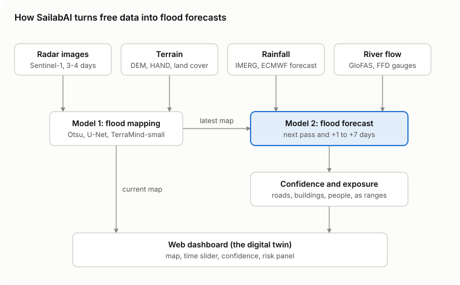
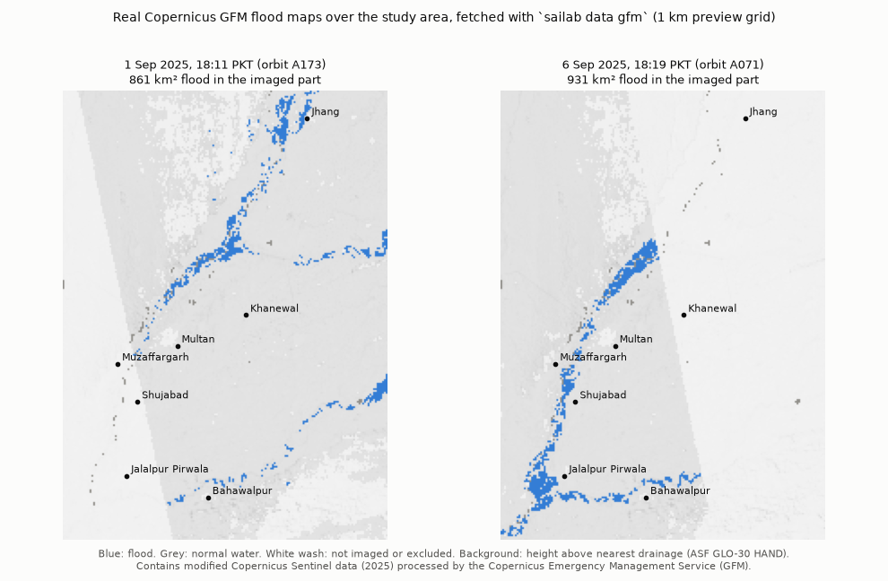

# SailabAI

A flood digital twin for the Chenab, Ravi and Sutlej rivers around Multan (the Trimmu to Panjnad
reach, about 42,000 km²). It maps today's flood from Sentinel-1 radar (**Model 1**) and forecasts the
chance of flooding for every pixel at the next satellite pass and +1, +2, +3, +5 and +7 days
(**Model 2**), with honest confidence levels and risk down to roads and buildings. *Sailab* means
flood in Urdu.

> **Experimental research output, not an official flood warning.** SailabAI is a final-year project
> for flood experts and planners (NDMA, PDMA, relief groups), not the general public. False
> disaster warnings are an offence under the NDM Act 2010 (section 35); every output carries this label.



## Where things stand

| Part | Status |
|---|---|
| Study area, grid, gauges, flood events, event-based splits | Done (`configs/`) |
| Synthetic demo world (terrain, 2014-2026 floods anchored to FFC peaks, radar, GFM-style labels) | Done, runs in ~2 min |
| Model 1: Otsu threshold, ResNet-34 U-Net | Done, trained on the demo world |
| Model 1: TerraMind-small via TerraTorch | Exporter and config done; fine-tune on Kaggle |
| Model 2: UNet-TT with modality dropout | Done, 5-seed ensemble trained on the demo world |
| Baselines: persistence, historical frequency, river threshold, XGBoost | Done |
| Calibration (temperature scaling, conformal sets and ranges), GloFAS members | Done |
| Evaluation protocol, one-shot test lock, shared results table | Done |
| Twin loop (daily forecasts, restart on every new pass), risk ranges | Done |
| FastAPI + PostGIS + map tiles, Next.js + MapLibre dashboard | Done |
| No-account data: GFM labels, DEM/HAND/JRC/WorldCover, WorldPop, buildings, OSM roads, EMS maps | Connectors done |
| Daily scrapers: FFD bulletins (+ parser), IRSA, ECMWF open data, VIIRS | Done (VIIRS needs its server path) |
| Account data: Sentinel-1 via HyP3/Earth Engine, GloFAS (EWDS), IMERG (Earthdata) | Connectors written, untested until accounts exist |

Everything runs end to end on the synthetic demo world today. Swapping in real data means filling
a real datacube with the connectors (see [docs/data.md](docs/data.md)); the models, evaluation,
twin and dashboard do not change.

The no-account connectors already work on real data. Real Copernicus GFM flood maps of the 2025
flood, pulled with `sailab data gfm` onto a 1 km preview grid, show the flood wave moving down the
Chenab from Jhang (1 Sep) to Shujabad and Jalalpur Pirwala (6 Sep):



## Results so far (synthetic demo world)

These scores show the pipeline works end to end; they say nothing yet about real-world skill. Full
tables: [results/RESULTS.md](results/RESULTS.md); every row sits next to its baseline.

| Model | 2023 validation flood | 2025 test flood (scored once) |
|---|---|---|
| Model 1 U-Net, F1 vs GFM / vs truth labels | 0.82 / 0.75 (Otsu 0.52 / 0.51) | 0.95 / 0.85 (Otsu 0.87 / 0.80) |
| Model 2 UNet-TT, Brier score (lower is better) | 0.0041-0.0047, best at all 7 lead times (persistence 0.0076-0.0084) | 0.029-0.041, worse than persistence (0.016-0.029) |
| Model 2 UNet-TT, calibration error | 0.0006-0.0015, best of all models | 0.025-0.046: over-confident |

**The honest reading.** On the validation flood, Model 2 gives the best and best-calibrated
probabilities, and beats "repeat the last map" at every lead time; the historical-frequency
baseline still has the best overlap scores. On the 2025 record flood, persistence wins at every lead
(overlap 0.52 at +1 day): Model 2 was trained only on smaller floods, pushes flooding into areas the
embankments protect, and misses water that lingered for weeks behind breaches. That is the main risk
the team guide names, caught by the one-shot test. It points straight at the next research step:
physics-guided forecasts that extrapolate to record floods, and a flag where inputs go beyond anything
seen in training.

## Quick start (Windows, laptop with an NVIDIA GPU)

```powershell
# Python 3.12 environment (uv is fastest; plain venv + pip works too)
python -m pip install uv
python -m uv venv .venv --python 3.12
python -m uv pip install --python .venv\Scripts\python.exe torch torchvision --index-url https://download.pytorch.org/whl/cu128
python -m uv pip install --python .venv\Scripts\python.exe -e ".[ml,geo,data,api,dev]"
.venv\Scripts\activate

sailab info                                   # paths, events, GPU
sailab synthetic generate --name demo         # the demo world (~2 min, ~300 MB)
sailab train mapping --epochs 12              # Model 1 U-Net
sailab train baselines                        # historical frequency, river threshold, XGBoost
sailab train forecast --seeds 0 --seeds 1 --seeds 2 --seeds 3 --seeds 4   # Model 2 ensemble
sailab calibrate                              # temperature scaling + conformal, on 2023
sailab evaluate mapping --split val
sailab evaluate forecast --split val          # results/results_table.csv and RESULTS.md
sailab twin replay 2025-08-10 2025-09-20      # the twin, day by day, as if live
sailab api serve                              # http://127.0.0.1:8000/docs
```

Dashboard, in a second terminal:

```powershell
cd web
npm install
npm run dev                                   # http://localhost:3000
```

Or everything (PostGIS, API, worker, dashboard) with Docker: `docker compose up -d --build`.

## How the pieces fit

```
configs/          study area, gauges, events and splits, licence register, TerraMind config
src/sailab/
  config.py grid.py events.py versioning.py licences.py    core rules
  cube.py io.py labels.py features.py                       the datacube: one layout for real and synthetic data
  synthetic/      the demo world
  sources/        real-data connectors and daily scrapers
  mapping/        Model 1 (Otsu, U-Net, TerraMind export)
  forecast/       Model 2 (UNet-TT inputs, training, ensemble, calibration, baselines, evaluation)
  nn/             network code (ResNet U-Net, UNet-TT)
  evaluation/     metrics, the team's scoring protocol, the results table
  risk/           exposure of people, buildings and roads, as ranges
  twin/           the daily loop
  db/ api/        PostGIS storage and the FastAPI backend (with map tiles)
  cli.py          the `sailab` command
web/              Next.js + MapLibre dashboard
tests/            pytest suite (runs on a tiny synthetic cube in about a minute)
results/          the shared results table (committed) and the test lock
docs/             architecture, data, models, evaluation, runbook, deployment
```

## Team rules, enforced in code

| Rule (team guide) | Where it lives |
|---|---|
| 1. Split data by flood event, never by random tiles | `EventRegistry`, `assert_no_leakage`; the 2025 test is scored once (`TestLock`, `results/test_lock.json`) |
| 2. Save data versions with every sample | `DataVersions` in every scene row and results row |
| 3. Every score next to its baseline | `ResultsTable.append` refuses a score without one |
| 4. Only commercial-safe data in the product | `LicenceRegister.check_use(..., "product")`; FABDEM and WorldFloods are tests only |
| 5. OSM roads stay a separate layer | `share_alike` in `configs/licences.yaml`; roads live in their own GeoJSON/table |
| 6. Never publish public warnings | `DISCLAIMER` stamped on every GeoTIFF, API response and dashboard page |

## Who owns what

| Member | Owns |
|---|---|
| Abdul Ghani | Data and platform: `sources/`, `synthetic/`, `cube.py`, `db/`, `api/`, `twin/`, `web/`, deployment, licence register |
| Member 2 | Model 1: `mapping/`, `nn/unet.py`, TerraMind (`configs/terramind_small.yaml`) |
| Member 3 | Model 2: `forecast/`, `nn/unet_tt.py`, baselines, calibration |
| All three | `evaluation/`, the results table, the live monsoon test, the report |

Work in branches with pull requests; CI runs lint, tests, a PostGIS integration job and the
dashboard build. See [CONTRIBUTING.md](CONTRIBUTING.md).

## Documentation

- [docs/architecture.md](docs/architecture.md): the twin loop, the datacube, storage, API
- [docs/data.md](docs/data.md): every data source, account, connector and licence
- [docs/models.md](docs/models.md): Model 1, Model 2, baselines, confidence; measured sizes and GPU memory
- [docs/evaluation.md](docs/evaluation.md): splits, scoring rules, targets, the results table
- [docs/runbook.md](docs/runbook.md): first-two-weeks checklist as commands, daily operations, live mode
- [docs/deployment.md](docs/deployment.md): Docker and the free hosting plan
- [docs/synthetic.md](docs/synthetic.md): what the demo world is, and what it is not

## Credits

Data credits are listed in [configs/licences.yaml](configs/licences.yaml) and on the dashboard's
About page. Basemap © OpenFreeMap, © OpenMapTiles, data © OpenStreetMap contributors.
